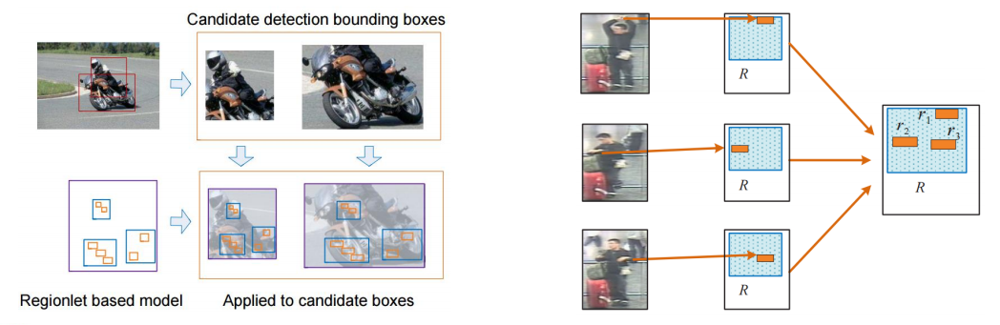
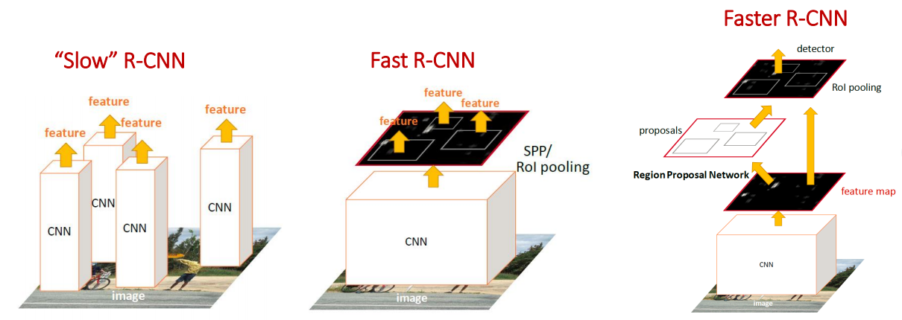

# Classification Versus Detection
Classification:What
Detection:What and Where
- So object detection is arguably a harder problem than classification 
- Heavy computational processing: Usually a large number of image sub-windows need ti be scanned in order to localize objects
- Challenge: In many real-world applications, running a fast object detector is as critical as running an accurate object detector.

# Applications
- MobilEye Forward Collision Warning
- Camera detects up to faces
- Video Analytics
- Self-Driving Cars

# Goals
- 保持高准确率的同时，加速物体检测
- 专注于最先进的技术
- 专注于软件工具而不是硬件加速

#Region Proposals
通用物体检测：候选区域生成
- 分组建议
- 窗口评分建议
- 度量标准和深入分析

# Regionlets for Generic Object Detection 
- Regionlet representation for handing object deformations
- Classification of region proposals based on boosted detector cascades
- Integration with CNN features

