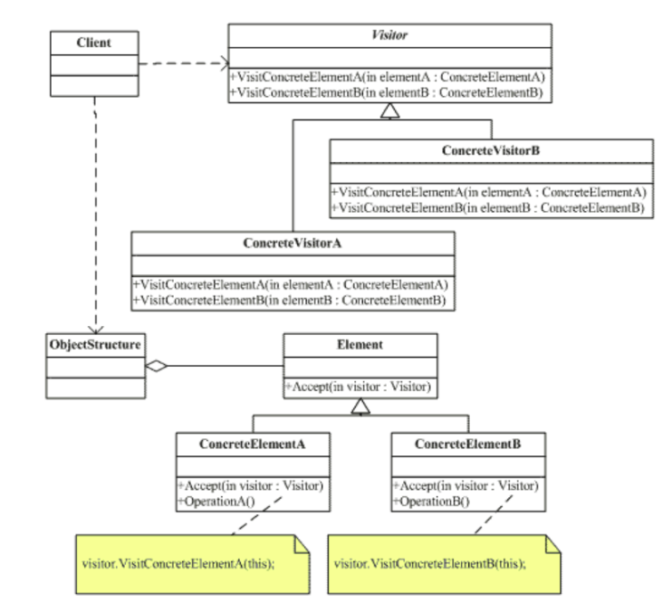
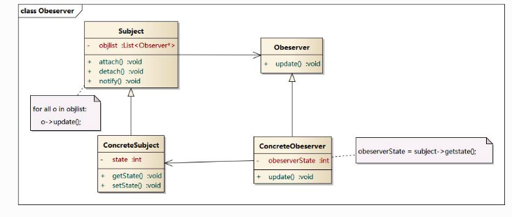
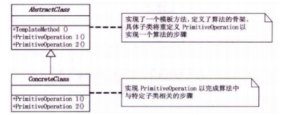
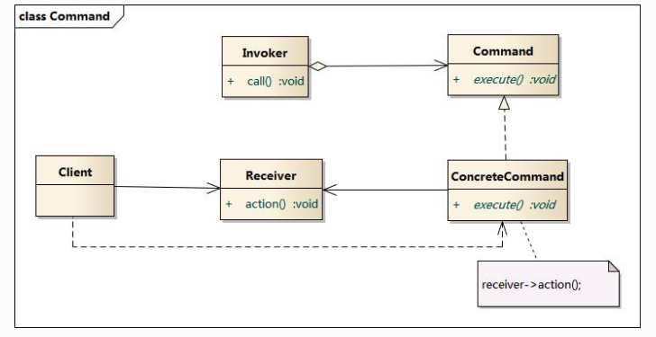
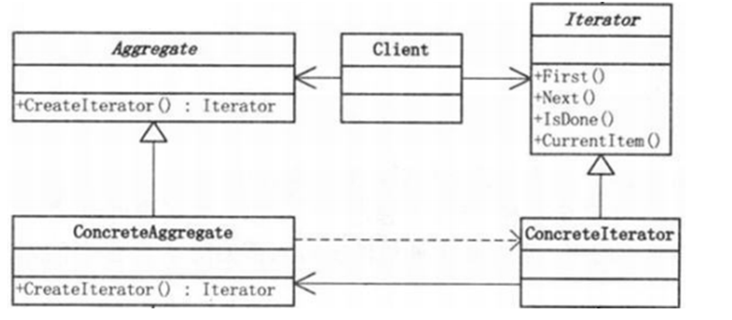
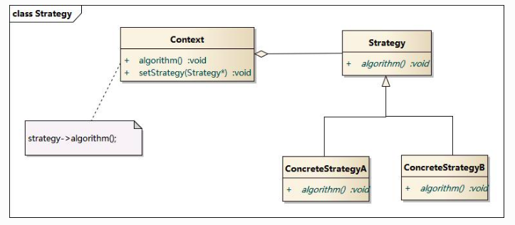

---
layout:		post
title:		设计模总结
subtitle:	Design Patterns
date:		2018-06-25
author:		QITINGSHE
header-img:	img/post-bg-designpattern.jpg
catalog: true
tags:
    - Design Pattern
---

# 概述

## 要点

- 明确何时使用何种模式
- 理解设计的组成成分以及成分之间的相互关系，各自职责、协作方式
- 模式的效果及使用模式应权衡的问题

## 设计模式的抽象层次

定义：对被用来在特定场景下解决一般设计问题的类和相互通信的对象的描述

主要是解决对象之间的交互问题

# 创建型模式

抽象实例化的过程，将关于当前系统的使用那些具体的类的信息封装起来，隐藏了这些类的实例是如何被创建和组建在一起的。如迷宫中的房间、门和墙等类

## 抽象工厂模式

目的：提供一个创建一系列相关或相互依赖对象的**接口**，而无需指定他们的具体类

适用条件：

- 一个系统要独立于他的产品的创建、组合和表示
- 一个系统要由多个产品系列中的一个来配置
- 当 要强调一系列相关的产品对象的设计以便进行联合使用
- 当提供一个产品库，而只想显示他们的接口而不是实现时

效果：

- 分离了具体的类（通过接口）
- 使得易于改变工厂中的对象
- 有利于产品的一致性
- 难于支持新的种类的对象（抽象工厂接口中确定了可以被创建的对象集合）

## 工厂模式

目的：定义一个用于创建对象的**接口**，让子类决定实例哪一个类，factory method 模式使一个类的实例化延迟到其子类

适用条件：

- 当一个类不知道它所必须创建的对象的类时
- 当一个类希望由它的子类来指定它所创建的对象时
- 当类将职责委托个多个辅助子类中的一个，而且将“具体是哪个辅助子类”的信息局部化

效果：

- 为子类提供挂钩
- 连接平行的类层次

相关模式：

- 抽象工厂经常用工厂方法来实现
- 工厂方法通常在模板模式中被调用
- 原型模式不需要创建子类

## 单例模式

目的：保证一个类仅有一个实例，并且提供一个访问它的全局访问点

动机：

- 对于一些类，只能有一个实例
- 使用全局变量可以去访问一个对象，当时不能防止用户实例化多个对象
- 单例模式让类自身负责保存它的唯一实例

适用性：

- 当类只有一个实例，且客户端可以从一个众所周知的访问点访问它时
- 当这个唯一实例应该是通过子类可扩展的，且client应该无需更改代码就能使用一个扩展的实例

## 生成器模式

目的：将一个复杂对象的***构建***与它的***表示***分离，使得同样的构建过程可以创建不同的表示

适用条件：

- 当创建复杂对象的**方法**应该***独立于***该对象的组成部分以及他们的装配方式
- 当构建过程必须被构造对象有不同的表示（多个表示可选）

效果：

-  可以改变一个产品的内部表示
- 将构造代码与表示代码分开
- 可以对构造过程进行更精细的控制

与抽象工厂的对比：

- 生成器模式着重于一步步构造一个复杂对象，而抽象工厂着重于多个系列的产品对象
- 生成器在最后一步返回产品，抽象工厂中产品是立即返回的

## 原型模式

目的：用原型实例指定创建对象的种类，并且通过拷贝这些原型创建新的对象

使用条件：

- 一个系统应该独立与他的类的创建、构成和表示时
- 当要实例化的类是运行时刻指定的
- 避免创建一个与产品类层次平行的工厂类层次
- 当一个类的实例只能有几个不同的状态组合中的一种时

效果：

- 对客户隐藏具体的产品类，使得客户不需要改变就可以使用特定应用相关的类
- 运行时刻和删除产品
- 改变值以指定新对象
- 改变结构以指定新对象
- 减少子类的构造
- 用类动态配置应用

---

# 结构型模式

## 适配器模式

## 装饰器模式

## 桥接模式

## 外观模式

## 代理模式

## 过滤器模式

## 组合模式

## 享元模式

# 行为型模式

行为模式涉及到算法和对象间职责的分配

- 描述对象或类的模式
- 描述他们之间的通信模式

行为模式是对在不同的对象之间划分责任和算法的抽象化。行为模式不仅仅关注类和对象的结构，而且重点关注他们之间的**相互作用**。通过行为模式，可以更加清晰第划分类与对象的职责，并且研究系统在运行时实例对象之间的交互。在系统运行时，对象不是孤立的，他们可以通过相互通信与协作完成某些复杂功能，一个对象在运行时也会影响到其他对象的运行。

行为型模式分为**类行为型模式**和**对象行为型模式**两种：

- 类行为型模式：类的行为型模式使用**继承**关系在几个类之间分配行为，类行为型模式主要通过**多态**等方式来分配父类与子类的职责。
- 对象行为型模式：对象的行为型模式则使用对象的**聚合关联**关系来分配行为，对象行为型模式主要是通过**对象关联**等方式来分配两个或多个类的职责。根据“合成复用原则”，系统中要尽量***使用关联关系来取代继承关系***，因此大部分行为型设计模式都属于对象行为型设计模式。

## 访问者模式

访问者模式表示一个作用于某对象结构中的个各元素的操作。它使你可以在不改变各元素的类的前提下定义作用于这些元素的新操作。

访问者模式适用于数据结构**相对稳定**的系统。它是将**数据结构**和**作用于结构上的操作**分离开来，完成了解耦，可以是操作集合自由演化，但不适合更改数据结构

## 观察者模式

一对多的依赖关系，在观察目标类里有一个 ArrayList 存放观察者们。当观察目标对象的**状态发生改变**，所有依赖于它的观察者都将得到通知，使这些观察者能够自动更新（即使用推送方式）

### 模式动机

建立一种对象与对象之间的依赖关系，一个对象发生改变时将自动通知其他对象，其他对象将相应做出反应。在此，发生改变的对象称为观察目标，而被通知的对象称为观察者，一个观察目标可以对应多个观察者，而且这些观察者之间没有相互联系，可以根据需要增加和删除观察者，使得系统更易于扩展，这就是观察者模式的模式动机。

### 定义

观察者模式(Observer Pattern)：定义对象间的一种一对多依赖关系，使得每当一个对象状态发生改变时，其相关依赖对象皆得到通知并被自动更新。观察者模式又叫做发布-订阅（Publish/Subscribe）模式、模型-视图（Model/View）模式、源-监听器（Source/Listener）模式或从属者（Dependents）模式。

观察者模式是一种对象行为型模式。

### 结构 

观察者模式包含如下角色：

- Subject: 目标
- ConcreteSubject: 具体目标
- Observer: 观察者
- ConcreteObserver: 具体观察者

### 分析

- 观察者模式描述了如何建立对象与对象之间的依赖关系，如何构造满足这种需求的系统。
- 这一模式中的关键对象是观察目标和观察者，一个目标可以有任意数目的与之相依赖的观察者，一旦目标的状态发生改变，所有的观察者都将得到通知。
- 作为对这个通知的响应，每个观察者都将即时更新自己的状态，以与目标状态同步，这种交互也称为**发布-订阅(publishsubscribe)**。目标是通知的发布者，它发出通知时并不需要知道谁是它的观察者，可以有任意数目的观察者订阅它并接收通知。

### 优点

- 观察者模式可以实现表示层和数据逻辑层的分离，并定义了稳定的消息更新传递机制，抽象了更新接口，使得可以有各种各样不同的表示层作为具体观察者角色。
- 观察者模式在观察目标和观察者之间建立一个抽象的耦合。
- 观察者模式支持广播通信。
- 观察者模式符合“开闭原则”的要求。

### 缺点

- 如果一个观察目标对象有很多直接和间接的观察者的话，将所有的观察者都通知到会花费很多时间。
- 如果在观察者和观察目标之间有循环依赖的话，观察目标会触发它们之间进行循环调用，可能导致系统崩溃。
- 观察者模式没有相应的机制让观察者知道所观察的目标对象是怎么发生变化的，而仅仅只是知道观察目标发生了变化。

### 适用环境

- 一个抽象模型有两个方面，其中一个方面依赖于另一个方面。将这些方面封装在独立的对象中使它们可以各自独立地改变和复用。
- 一个对象的改变将导致其他一个或多个对象也发生改变，而不知道具体有多少对象将发生改变，可以降低对象之间的耦合度。
- 一个对象必须通知其他对象，而并不知道这些对象是谁。
- 需要在系统中创建一个触发链，A对象的行为将影响B对象，B对象的行为将影响C对象……，可以使用观察者模式创建一种链式触发机制。

观察者模式在软件开发中应用非常广泛，如某电子商务网站可以在执行发送操作后给用户多个发送商品打折信息，某团队战斗游戏中某队友牺牲将给所有成员提示等等，凡是涉及到一对一或者一对多的对象交互场景都可以使用观察者模式。

### 扩展

- MVC模式是一种架构模式，它包含三个角色：模型(Model)，视图(View)和控制器(Controller)。观察者模式可以用来实现MVC模式，观察者模式中的观察目标就是MVC模式中的模型(Model)，而观察者就是MVC中的视图(View)，控制器(Controller)充当两者之间的中介者(Mediator)。当模型层的数据发生改变时，视图层将自动改变其显示内容。

### 总结

- 观察者模式定义对象间的一种一对多依赖关系，使得每当一个对象状态发生改变时，其相关依赖对象皆得到通知并被自动更新。观察者模式又叫做发布-订阅模式、模型-视图模式、源-监听器模式或从属者模式。观察者模式是一种对象行为型模式。
- 观察者模式包含四个角色：目标又称为主题，它是指被观察的对象；具体目标是目标类的子类，通常它包含有经常发生改变的数据，当它的状态发生改变时，向它的各个观察者发出通知；观察者将对观察目标的改变做出反应；在具体观察者中维护一个指向具体目标对象的引用，它存储具体观察者的有关状态，这些状态需要和具体目标的状态保持一致。
- 观察者模式定义了一种一对多的依赖关系，让多个观察者对象同时监听某一个目标对象，当这个目标对象的状态发生变化时，会通知所有观察者对象，使它们能够自动更新。
- 观察者模式的主要优点在于可以实现表示层和数据逻辑层的分离，并在观察目标和观察者之间建立一个抽象的耦合，支持广播通信；其主要缺点在于如果一个观察目标对象有很多直接和间接的观察者的话，将所有的观察者都通知到会花费很多时间，而且如果在观察者和观察目标之间有循环依赖的话，观察目标会触发它们之间进行循环调用，可能导致系统崩溃。
- 观察者模式适用情况包括：一个抽象模型有两个方面，其中一个方面依赖于另一个方面；一个对象的改变将导致其他一个或多个对象也发生改变，而不知道具体有多少对象将发生改变；一个对象必须通知其他对象，而并不知道这些对象是谁；需要在系统中创建一个触发链。
- 在JDK的java.util包中，提供了Observable类以及Observer接口，它们构成了Java语言对观察者模式的支持。

## 模板模式

模版方法模式定义一个操作的算法骨架，而将一些步骤延迟到子类中，模版方法使得子类可以不改变一个算法的结构即可重定义该算法的某些特定步骤。

模版方法就是把不变的行为搬到了超类中，去除了子类中的重复代码。

多个客户去银行开户，大家都需要填写一个开户表单，表单的格式都是一样的，但是每个人填写的内容却是不同的，客户是需要填写不同的内容即可，而不是把整个表单抄一遍。

## 命令模式

### 动机

在软件设计中，我们经常需要向某些对象发送请求，但是并不知道请求的接收者是谁，也不知道被请求的操作是哪个，我们只需在程序运行时指定具体的请求接收者即可，此时，可以使用命令模式来进行设计，使得请求发送者与请求接收者消除彼此之间的耦合，让对象之间的调用关系更加灵活。

命令模式可以对发送者和接收者完全解耦，发送者与接收者之间没有直接引用关系，发送请求的对象只需要知道如何发送请求，而不必知道如何完成请求。这就是命令模式的模式动机。

### 定义

命令模式(Command Pattern)：将一个请求封装为一个对象，从而使我们可用不同的请求对客户进行参数化；对请求排队或者记录请求日志，以及支持可撤销的操作。命令模式是一种对象行为型模式，其别名为动作(Action)模式或事务(Transaction)模式。

### 结构

命令模式包含如下角色：

- Command: 抽象命令类
- ConcreteCommand: 具体命令类
- Invoker: 调用者
- Receiver: 接收者
- Client:客户类

### 分析

命令模式的本质是对命令进行封装，将发出命令的责任和执行命令的责任分割开。

- 每一个命令都是一个操作：请求的一方发出请求，要求执行一个操作；接收的一方收到请求，并执行操作。
- 命令模式允许请求的一方和接收的一方独立开来，使得请求的一方不必知道接收请求的一方的接口，更不必知道请求是怎么被接收，以及操作是否被执行、何时被执行，以及是怎么被执行的。
- 命令模式使请求本身成为一个对象，这个对象和其他对象一样可以被存储和传递。
- 命令模式的关键在于引入了抽象命令接口，且发送者针对抽象命令接口编程，只有实现了抽象命令接口的具体命令才能与接收者相关联。

### 优点

命令模式的优点

- 降低系统的耦合度。
- 新的命令可以很容易地加入到系统中。
- 可以比较容易地设计一个命令队列和宏命令（组合命令）。
- 可以方便地实现对请求的Undo和Redo。

### 缺点

命令模式的缺点

- 使用命令模式可能会导致某些系统有过多的具体命令类。因为针对每一个命令都需要设计一个具体命令类，因此某些系统可能需要大量具体命令类，这将影响命令模式的使用。

### 适用环境

在以下情况下可以使用命令模式：

- 系统需要将请求调用者和请求接收者解耦，使得调用者和接收者不直接交互。
- 系统需要在不同的时间指定请求、将请求排队和执行请求。
- 系统需要支持命令的撤销(Undo)操作和恢复(Redo)操作。
- 系统需要将一组操作组合在一起，即支持宏命令

### 应用

很多系统都提供了宏命令功能，如UNIX平台下的Shell编程，可以将多条命令封装在一个命令对象中，只需要一条简单的命令即可执行一个命令序列，这也是命令模式的应用实例之一。

### 模式扩展

宏命令又称为组合命令，它是命令模式和组合模式联用的产物。

-宏命令也是一个具体命令，不过它包含了对其他命令对象的引用，在调用宏命令的execute()方法时，将递归调用它所包含的每个成员命令的execute()方法，一个宏命令的成员对象可以是简单命令，还可以继续是宏命令。执行一个宏命令将执行多个具体命令，从而实现对命令的批处理。

### 总结

- 在命令模式中，将一个请求封装为一个对象，从而使我们可用不同的请求对客户进行参数化；对请求排队或者记录请求日志，以及支持可撤销的操作。命令模式是一种对象行为型模式，其别名为动作模式或事务模式。
- 命令模式包含四个角色：抽象命令类中声明了用于执行请求的execute()等方法，通过这些方法可以调用请求接收者的相关操作；具体命令类是抽象命令类的子类，实现了在抽象命令类中声明的方法，它对应具体的接收者对象，将接收者对象的动作绑定其中；调用者即请求的发送者，又称为请求者，它通过命令对象来执行请求；接收者执行与请求相关的操作，它具体实现对请求的业务处理。
- 命令模式的本质是对命令进行封装，将发出命令的责任和执行命令的责任分割开。命令模式使请求本身成为一个对象，这个对象和其他对象一样可以被存储和传递。
- 命令模式的主要优点在于降低系统的耦合度，增加新的命令很方便，而且可以比较容易地设计一个命令队列和宏命令，并方便地实现对请求的撤销和恢复；其主要缺点在于可能会导致某些系统有过多的具体命令类。
- 命令模式适用情况包括：需要将请求调用者和请求接收者解耦，使得调用者和接收者不直接交互；需要在不同的时间指定请求、将请求排队和执行请求；需要支持命令的撤销操作和恢复操作，需要将一组操作组合在一起，即支持宏命令。

## 迭代器模式

迭代器模式提供了一种方法**顺序访问**一个聚合对象中各个元素，而又不需要暴露该对象的内部表示。当我们需要对聚集有**多种方式遍历**时，可以考虑用迭代器模式。迭代器模式提供“开始、下一个、是否结束、当前哪一项…”等统一的接口。

迭代器模式分离了集合对象的遍历行为，抽象出一个迭代器类来负责，这样既可以做到不暴露内部结构，又可以让外部代码透明底访问集合内部的数据。松散了耦合性，做到了信息隐蔽。

比如老师向班长要一个学生花名册，班长可以按学号进行排列，也可以按姓名首字母进行排列，只要包括了全部学生就行了。

## 策略模式

### 动机

- 完成一项任务，往往可以有多种不同的方式，每一种方式称为一个策略，我们可以根据环境或者条件的不同选择不同的策略来完成该项任务。
- 在软件开发中也常常遇到类似的情况，实现某一个功能有多个途径，此时可以使用一种设计模式来使得系统可以灵活地选择解决途径，也能够方便地增加新的解决途径。
- 在软件系统中，有许多算法可以实现某一功能，如查找、排序等，一种常用的方法是硬编码(Hard Coding)在一个类中，如需要提供多种查找算法，可以将这些算法写到一个类中，在该类中提供多个方法，每一个方法对应一个具体的查找算法；当然也可以将这些查找算法封装在一个统一的方法中，通过if…else…等条件判断语句来进行选择。这两种实现方法我们都可以称之为硬编码，如果需要增加一种新的查找算法，需要修改封装算法类的源代码；更换查找算法，也需要修改客户端调用代码。在这个算法类中封装了大量查找算法，该类代码将较复杂，维护较为困难。
- 除了提供专门的查找算法类之外，还可以在客户端程序中直接包含算法代码，这种做法更不可取，将导致客户端程序庞大而且难以维护，如果存在大量可供选择的算法时问题将变得更加严重。
- 为了解决这些问题，可以定义一些独立的类来封装不同的算法，每一个类封装一个具体的算法，在这里，每一个封装算法的类我们都可以称之为策略(Strategy)，为了保证这些策略的一致性，一般会用一个抽象的策略类来做算法的定义，而具体每种算法则对应于一个具体策略类。

### 定义

策略模式(Strategy Pattern)：定义一系列算法，将每一个算法封装起来，并让它们可以相互替换。策略模式让算法独立于使用它的客户而变化，也称为政策模式(Policy)。

策略模式是一种对象行为型模式。

### 结构

- Context: 环境类
- Strategy: 抽象策略类
- ConcreteStrategy: 具体策略类

### 分析

- 策略模式是一个比较容易理解和使用的设计模式，策略模式是对算法的封装，它把算法的责任和算法本身分割开，委派给不同的对象管理。策略模式通常把一个系列的算法封装到一系列的策略类里面，作为一个抽象策略类的子类。用一句话来说，就是“准备一组算法，并将每一个算法封装起来，使得它们可以互换”。
- 在策略模式中，应当由客户端自己决定在什么情况下使用什么具体策略角色。
- 策略模式仅仅封装算法，提供新算法插入到已有系统中，以及老算法从系统中“退休”的方便，策略模式并不决定在何时使用何种算法，算法的选择由客户端来决定。这在一定程度上提高了系统的灵活性，但是客户端需要理解所有具体策略类之间的区别，以便选择合适的算法，这也是策略模式的缺点之一，在一定程度上增加了客户端的使用难度。

### 优点

- 策略模式提供了对“开闭原则”的完美支持，用户可以在不修改原有系统的基础上选择算法或行为，也可以灵活地增加新的算法或行为。
- 策略模式提供了管理相关的算法族的办法。
- 策略模式提供了可以替换继承关系的办法。
- 使用策略模式可以避免使用多重条件转移语句。

### 缺点

- 客户端必须知道所有的策略类，并自行决定使用哪一个策略类。
- 策略模式将造成产生很多策略类，可以通过使用享元模式在一定程度上减少对象的数量。

### 适用环境

- 如果在一个系统里面有许多类，它们之间的区别仅在于它们的行为，那么使用策略模式可以动态地让一个对象在许多行为中选择一种行为。
- 一个系统需要动态地在几种算法中选择一种。
- 如果一个对象有很多的行为，如果不用恰当的模式，这些行为就只好使用多重的条件选择语句来实现。
- 不希望客户端知道复杂的、与算法相关的数据结构，在具体策略类中封装算法和相关的数据结构，提高算法的保密性与安全性。

### 模式扩展

策略模式与状态模式

- 可以通过环境类状态的个数来决定是使用策略模式还是状态模式。
- 策略模式的环境类自己选择一个具体策略类，具体策略类无须关心环境类；而状态模式的环境类由于外在因素需要放进一个具体状态中，以便通过其方法实现状态的切换，因此环境类和状态类之间存在一种双向的关联关系。
- 使用策略模式时，客户端需要知道所选的具体策略是哪一个，而使用状态模式时，客户端无须关心具体状态，环境类的状态会根据用户的操作自动转换。
- 如果系统中某个类的对象存在多种状态，不同状态下行为有差异，而且这些状态之间可以发生转换时使用状态模式；如果系统中某个类的某一行为存在多种实现方式，而且这些实现方式可以互换时使用策略模式。

### 总结

- 在策略模式中定义了一系列算法，将每一个算法封装起来，并让它们可以相互替换。策略模式让算法独立于使用它的客户而变化，也称为政策模式。策略模式是一种对象行为型模式。
- 策略模式包含三个角色：环境类在解决某个问题时可以采用多种策略，在环境类中维护一个对抽象策略类的引用实例；抽象策略类为所支持的算法声明了抽象方法，是所有策略类的父类；具体策略类实现了在抽象策略类中定义的算法。
- 策略模式是对算法的封装，它把算法的责任和算法本身分割开，委派给不同的对象管理。策略模式通常把一个系列的算法封装到一系列的策略类里面，作为一个抽象策略类的子类。
- 策略模式主要优点在于对“开闭原则”的完美支持，在不修改原有系统的基础上可以更换算法或者增加新的算法，它很好地管理算法族，提高了代码的复用性，是一种替换继承，避免多重条件转移语句的实现方式；其缺点在于客户端必须知道所有的策略类，并理解其区别，同时在一定程度上增加了系统中类的个数，可能会存在很多策略类。
- 策略模式适用情况包括：在一个系统里面有许多类，它们之间的区别仅在于它们的行为，使用策略模式可以动态地让一个对象在许多行为中选择一种行为；一个系统需要动态地在几种算法中选择一种；避免使用难以维护的多重条件选择语句；希望在具体策略类中封装算法和与相关的数据结构。

 