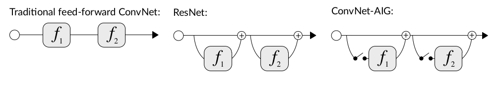
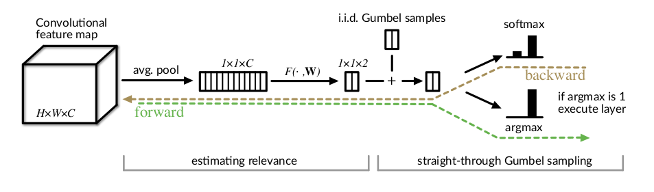
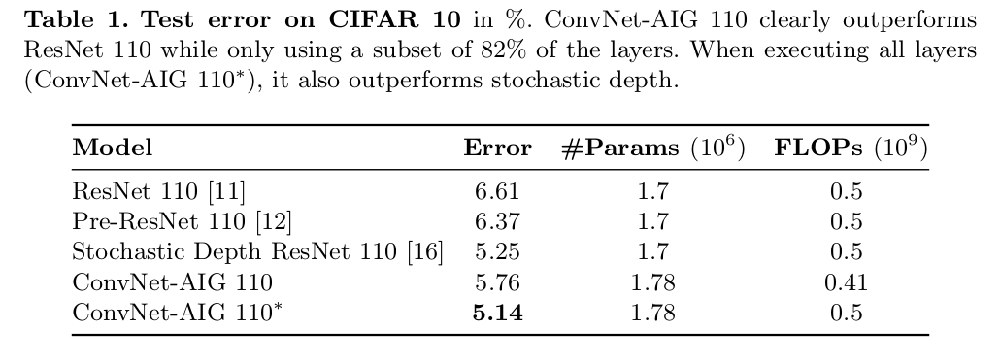
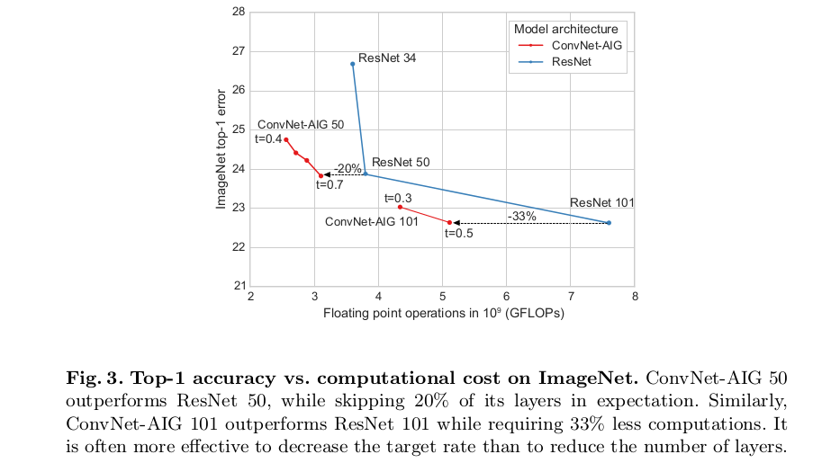

---
layout:		post
title:		Convolutional Networks with Adaptive Inference Graphs
subtitle:	自适应推理图
date:		2018-09-08
author:		QITINGSHE
header-img:	img/post-bg-girl.jpg
catalog: true
tags:
    - 深度学习
---

在经过一些层后，卷积神经网络已经具有识别高阶概念的能力。假设高层网络具有某些特定功能，如：分辨鸟类，当输入一张图片，如果网络已经分辨出图片包含一只鸟，那网络可以直接进入负责分类鸟儿的层，跳过中间一些无关层，直观的讲，网络知道的越多，它就能够越好的决定下一步应该交由哪一层来计算。有点像决策树，选择最有价值的特征信息来进行计算。

之前有人研究resnet发现，几乎任何一个独立的layer都可以从训练好的resnet中去掉，而且还不会干扰其他的layers。这给我们一个启发，谁规定神经网络一定要有一个固定的结构？我们就不能依据不同输入动态的组装网络结构图？

由此我们提出了ConvNet-AIG——具有自适应推理图的卷积网络，他的推理图取决于输入图像，ConvNet-AIG对每个输入图像可以自由的决定哪一层是需要的。在ImageNet上，同样是50层或101层，ConvNet-AIG要比resnet少20%～30%的计算量。通过将相关类别的参数整合到某些层中，我们可以只计算相关的层。这样ConvNet-AIG在效率和整体分类质量上都获得提升。最后在对抗例子中，我们发现ConvNet-AIG表现出更好的稳健性。

观察上图，我们发现，ConvNet-AIG和ResNet很像，他们的区别就是ConvNet-AIG有一个gate来决定跳过与否，这样就实现了对不同输入做不同的推理图。

通过学习通用层（对所有图片都有效）和专业层（对特定类别子集有效），需要指出的是，ConvNet-AIG无需监督。

我们将gate建模为离散随机结点，分为两个阶段：对各层做计算或跳过；gate取决于先前网络层的输出。这样就可以基于输入自适应的构建推理图，而且可以将卷积权重和离散gates联合起来做端到端的训练。

在实验阶段，we demonstrate that ConvNet-AIG effectively learns to generate inference graphs such that **for each input only relevant features are computed.** ConvNet-AIG 50 和ConvNet-AIG 101的表现均好于对应的ResNet版本，同时计算量还减小了20%～33%。进一步的研究表明，没有经过特殊的监督学习，ConvNet-AIG 发现了部分类别结构，并且学习让特定层来关注类别的子集，如动物和人造物。甚至可以学习推理图来辨认中等级别的类别如鸟类、狗以及爬行动物。通过将相关类别的参数组织起来，然后执行相关层，ConvNet-AIG既提高了计算效率还提升了整体分类的准确率。最后我们还研究了自适应推理图在对抗j例子中的效果，发现ConvNet-AIG比resnet有更好的稳健性。

本文工作有点类似Dropout，类似一个完整的ResNet在迭代时随机去除一些层，我们的工作是在网络结构中包含一些结点，然后决定是否去执行该层。随机移除层会造成层中信息冗余，但在我们的工作中，我们构建的推理图是基于输入图像的，可以减小冗余，还能让网络学习数据中特定的子类信息。

每个gate包含两个部分，第一个用来估计要计算的层的相关性，第二部分决定是否执行给定相关性的层，Gumbel-Max trick和softmax relaxation用于通过离散决策来做梯度的传播。

- 为了估计层间的相关性，gate需要理解输入特征，为了防止模型陷入某些独立的输入特征，如总是或从不执行某一层。保证gate的随机性是一个关键点，为此我们引入噪声来估计相关性。
- gate需要作出离散决策，同时还要提供相关性估计的梯度信息。为了实现该功能，我们采用Gumbel-Max trick和他的softmax relaxation.
- gate需要较低的计算来执行

## Training Loss

引入一个Target rate *t* ，用于决定每层的执行率

